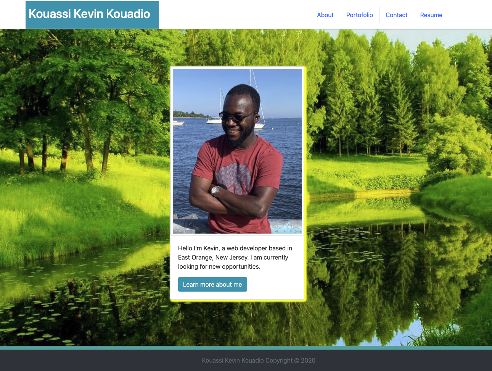
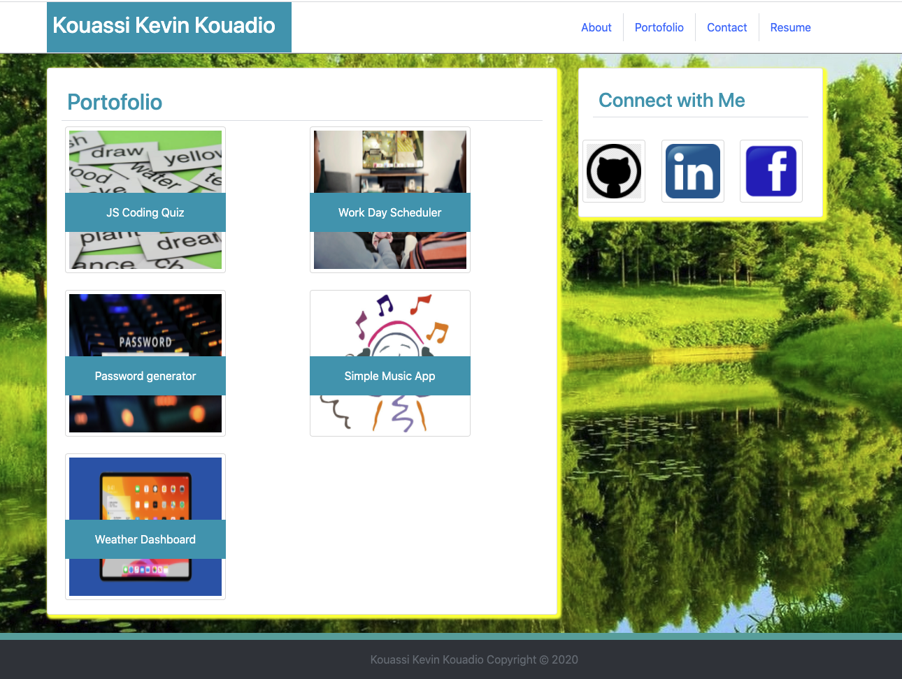

## Week 2 Rutgers Full stack developper bootcamp homework - Portfolio

Vew link : https://kevkouadio.github.io/kevkouadio-portofolio/home.html

Summary
Use of bootstrap CSS to creat this portofolio.
This project uses materialize for formatting, styling and mobile compatability
This project has the following features:
This project features responsive design using a Bootstrap layout
Has responsive layout for Mobile devices (phones and tablet) 

To Execute File:
Open in browser

Features:
Five HTML Pages
home.html
Index.html
Contains About Me section with Navigation
Provides summary of background and experience
Portfolio Page
Contains examples of previous projects
Contact Page
Contains contact information
and my resume 
One CSS Page
Styles.css
Contains styling and layout for all html pages

Here are the screenshot: 

 